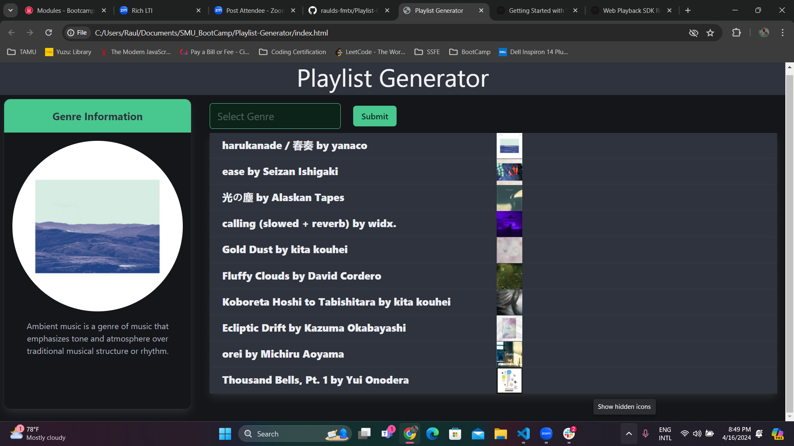

# Playlist-Generator

## Description

This web application enables a user to find spotify song recommendations by searching through over 120 genres and dozens of spotify created playlists using the Spotify Web API. The song recommendations include the track title, artists name, and album cover. In addition, it will display information about a queried provided through Wikipedia.

## Link

[Click Here to Deploy Page](https://raulds-fmtx.github.io/Playlist-Generator/)
[Click Here to View Presentation](https://docs.google.com/presentation/d/1NxaWnkMND3Ursb4TN70Tl4-tPhlOtSWn-A3sxEu1zFY/edit?usp=sharing)

## Usage

To find song recommendations search up a genre you are interested in and select from any of the autocomplete results. Click the green submit to search spotify for available playlists in this genre and deploy the playlist select modal. If no genre is available exit the modal and search for a new genre. Otherwise, select a playlist from the dropdown menu and click the blue submit button. This will display the first ten songs in this spotify playlist in the main section. The left panel will display an album cover image from the playlist. In addition, a description of the genre pulled from an available wikipedia page will appear. If no wiki description is available, a link will be provided to a webpage related to the genre you searched for.

## Credits

Created by Raul Santos, Jerrika Gabriel, Devin Hayes, and Christian Hammon

## License

Please refer to the LICENSE in the repo.
